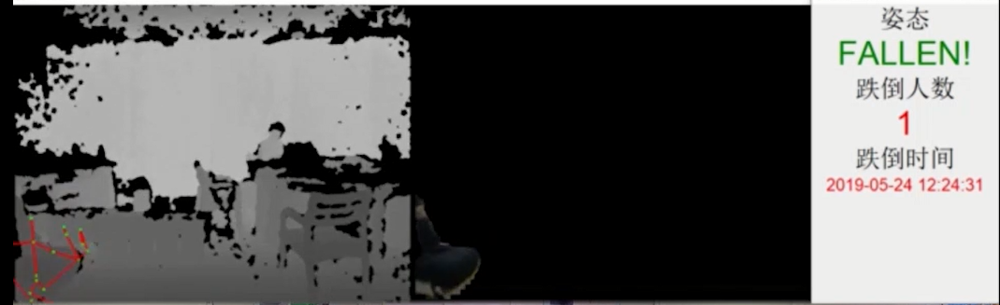
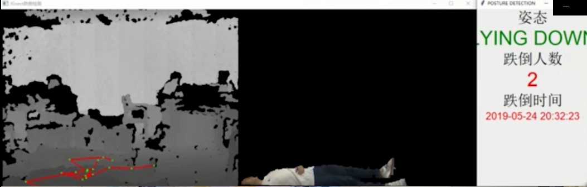
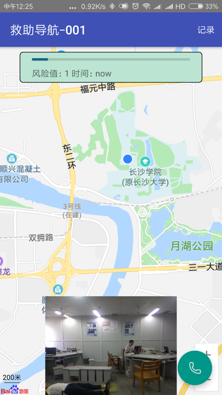

# 基于视频的老人跌倒监护

## 一、项目简介
&emsp;&emsp;该项目主要包括使用机器学习等基本学科作为辅助完成日常的老人监护跌倒检测，如实现对在监护范围内**一个或者多个老人**的跌倒或者可疑跌倒的动作进行检测报警等功能，监护工作人员可以通过远程监控系统对监护范围内的老人进行实时监护，以及对系统反馈的检测报警信息进行人工确认，能够为老人居家监护提供很好的监护服务。

## 二、项目技术流程
1. 利用kinect深度摄像头进行**人体关键骨骼数据**和**深度图像**等数据采集；
2. 对所采集的数据进行处理，如对骨骼数据进行平滑处理；
3. 采用**LSTM循环神经网络**与采集的数据训练出**人体姿态模型**；
4. 采用**跌倒检测算法**对监护人进行检测，如果出现跌倒或者可疑跌倒的情况进行跌倒图片采集并**报警**。

## 三、环境(wiondows) 及运行 
-- 下载kinect SDK 2.0      
-- 下载visvaul Stdio 2017  
-- 下载python 3.0  
通过pc端连接kinect摄像头，运行kinect.cpp和main.py两个启动程序同时进行运行。

## 五、项目效果

&emsp;&emsp;在摄像头监控范围内，对一个或者多个老人的跌倒或者可以跌倒的动作进行检测，通过使用训练的人体姿态识别模型与跌倒识别算法的结合，在楼梯、房间、强光、暗光和黑暗等多种环境下，使**准确率能够达到94%左右**。  
&emsp;&emsp;运行效果图：
  
&emsp;&emsp;&emsp;&emsp;&emsp;&emsp;&emsp;&emsp;&emsp;&emsp;&emsp;&emsp;&emsp;&emsp;&emsp;&emsp;&emsp;&emsp;&emsp;&emsp;&emsp;&emsp;&emsp;&emsp;单人跌倒图  
  
&emsp;&emsp;&emsp;&emsp;&emsp;&emsp;&emsp;&emsp;&emsp;&emsp;&emsp;&emsp;&emsp;&emsp;&emsp;&emsp;&emsp;&emsp;&emsp;&emsp;&emsp;&emsp;&emsp;&emsp;多人跌倒图  
  
&emsp;&emsp;&emsp;&emsp;&emsp;&emsp;&emsp;&emsp;&emsp;&emsp;手机客户端报警图

